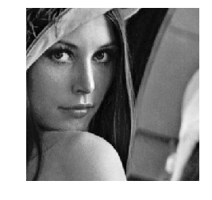
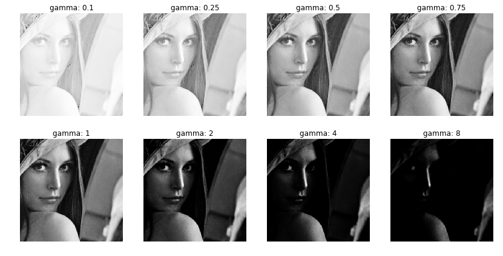
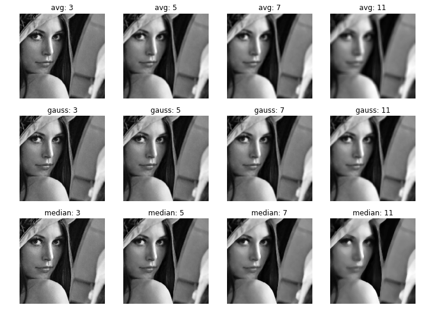
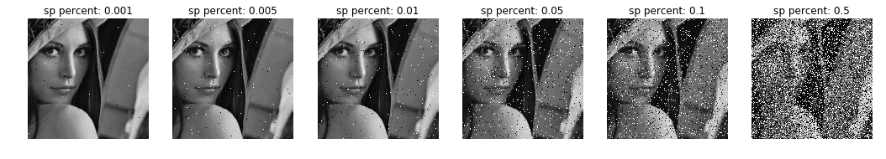
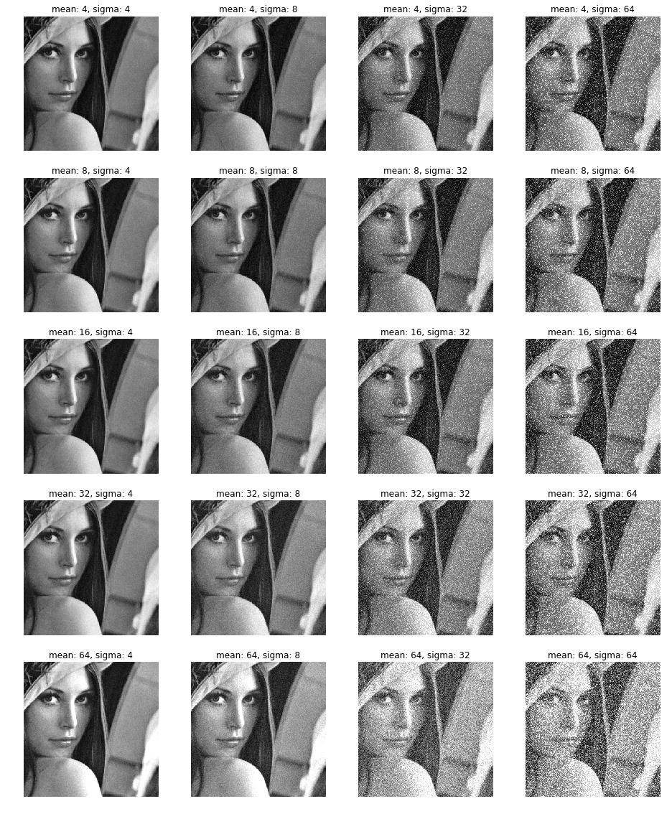
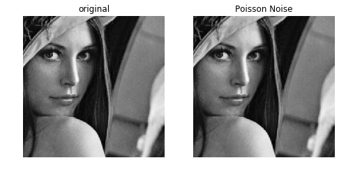
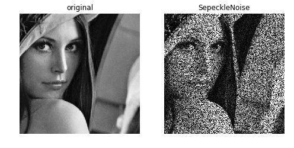
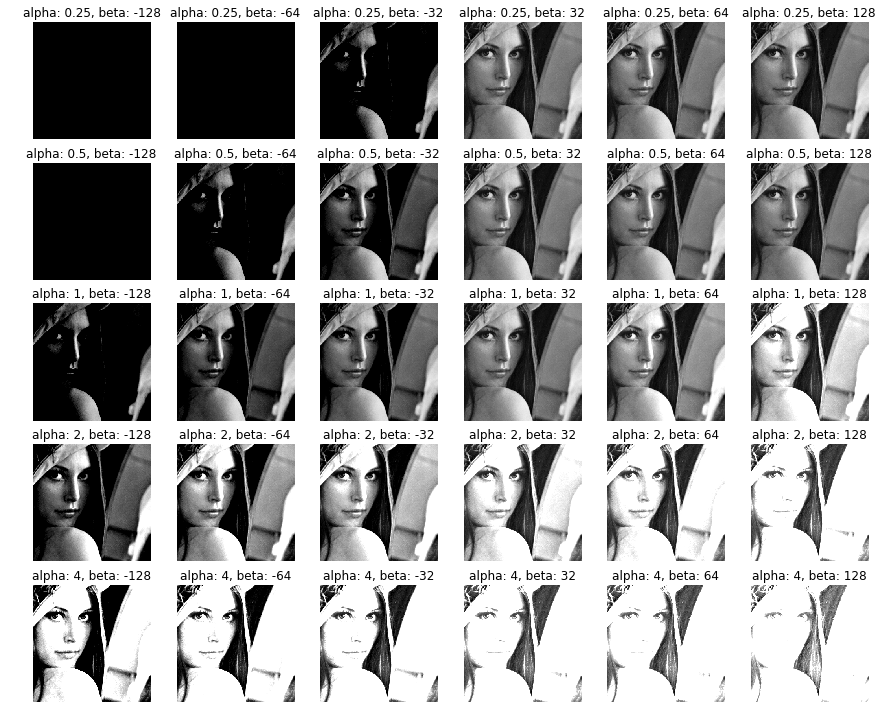
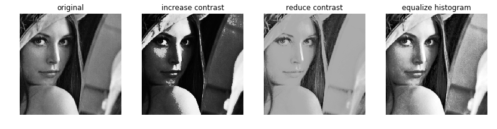

# Image Transformations

This documents are a example to image transfromation functions using opencv and numpy on python.

### Step 0

Import dependences and input images. Input image is located on `media/images/` directory.


```python
import numpy as np
import matplotlib.pyplot as plt

import cv2
```


```python
original_image = cv2.imread("media/images/face.png", 0)
print(original_image.shape)
```

    (300, 300)


```python
plt.figure(figsize=(4,4))
plt.imshow(original_image, cmap="gray")
plt.axis('off')
plt.show()
```





### Step 1: Ilumination

Illumination filter use gamma function to add brightness or darkness to image. If gamma value must be a real positive. If value is less to one, images is cleared, if value is higer to one, image is darkenet. If gamma is equal to 1, function return the same input image. 

More info about gamma function here: https://docs.opencv.org/3.4/d3/dc1/tutorial_basic_linear_transform.html 

Look this examplee:


```python
from illumination import GammaFilter
```


```python
gf = GammaFilter()
gamma_values = [0.1, 0.25, 0.5, 0.75, 1, 2, 4, 8]
```


```python
config_dict = {"gamma":0}

plt.figure(figsize=(14,7))
for i, item in enumerate(gamma_values):
    config_dict["gamma"] = item
    gf.config(config_dict)
    plt.subplot(2, 4, i + 1)
    plt.title("gamma: {}".format(item))
    plt.imshow(gf.filter(original_image), cmap="gray")
    plt.axis('off')
plt.show()
```





### Step 2: Blur

Blur is another way to modify an picture. In this example we use three way to apply blur. **AvgBlur** set each pixel avergare value of your neighbors, **MedianBlur** apply an median instead of average and **GaussianBlur** use a gaussian kernel to blur image.

Neighbors used depend on **kernel** value, an kernel value high increase smoothing effect on image.  

More info here: https://docs.opencv.org/master/d4/d13/tutorial_py_filtering.html


```python
from blur import AvgBlur, GaussianBlur, MedianBlur
```


```python
filters = [AvgBlur(), GaussianBlur(), MedianBlur()]
names = ["avg: ", "gauss: ", "median: "]
kernels = [3, 5, 7, 11]
```


```python
plt.figure(figsize=(3 * len(kernels), 3 * len(filters)))
plt.axis('off')
for i, f in enumerate(filters):
    for j,k in enumerate(kernels):
        c_config = {"kernel": k}
        f.config(c_config)
        output_image = f.filter(original_image)

        plt.subplot(len(filters), len(kernels), j + 1 + i*len(kernels))
        plt.title(names[i] + str(k))
        plt.imshow(output_image, cmap="gray")
        plt.axis('off')
plt.show()
```





### Step 3: Noise

Add noise is a effective way to modify a image. This examples apply Salt-Peper noise, Gaussian Noise, Sperckle noise. 

**Salt-Peper Noise** set a random pixel to maximun and minimun values, in this case, 255 and 0.


```python
from noise import SPNoise, GaussianNoise, PoissonNoise
```


```python
sp_values = [0.001, 0.005, 0.01, 0.05, 0.1, 0.5]
spnoiser = SPNoise()
```


```python
plt.figure(figsize=(3 * len(sp_values), 4))
for i, item in enumerate(sp_values):
    spnoiser.config({"percent": item})
    output_image = spnoiser.addNoise(original_image)
    plt.subplot(1, len(sp_values), i + 1)
    plt.title("sp percent: {}".format(item))
    plt.imshow(output_image, cmap="gray")
    plt.axis('off')
plt.show()
```





**Gausian Noise** add a random gaussian value to each pixel, this values are defined by a gaussian probabilty function with mean $\mu$ and variance $\sigma$. This values can be modified.   


```python
gauss_noiser = GaussianNoise()

mean_values = [4, 8, 16, 32, 64]
sigma_values = [4, 8, 32, 64]

plt.figure(figsize=(4 * len(sigma_values), 4 * len(mean_values)))

for i, u in enumerate(mean_values):
    for j,s in enumerate(sigma_values):
        gauss_noiser.config({"mean": u, "sigma": s})
        output_image = gauss_noiser.addNoise(original_image)
        # print(output_image.shape)

        plt.subplot(len(mean_values), len(sigma_values), j + 1 + i*len(sigma_values))
        plt.title("mean: {}, sigma: {}".format(u,s))
        plt.imshow(output_image, cmap="gray")
        plt.axis('off')
plt.show()
        
```





**Poisson Noise** Poisson noise add to each pixel a radom value defined by poisson propabilty function.  


```python
pn = PoissonNoise()
output_image = pn.addNoise(original_image)
```


```python
plt.figure(figsize=(8,4))

plt.subplot(1,2,1)
plt.title("original")
plt.imshow(original_image, cmap="gray")
plt.axis('off')

plt.subplot(1,2,2)
plt.title("Poisson Noise")
plt.imshow(output_image, cmap="gray")
plt.axis('off')

plt.show()
```





**Sperckle Noise** multiply each pixel by a random value defined by gaussian probability funtion. 


```python
from noise import SepeckleNoise
sn = SepeckleNoise()
output_image = sn.addNoise(original_image)
```


```python
plt.figure(figsize=(8,4))

plt.subplot(1,2,1)
plt.title("original")
plt.imshow(original_image, cmap="gray")
plt.axis('off')

plt.subplot(1,2,2)
plt.title("SepeckleNoise")
plt.imshow(output_image, cmap="gray")
plt.axis('off')

plt.show()
```





###  Step 4: contrast

A simple way to increase and reduce brightness and contrast of a images, is changing range of pixels function of an image. You can reduce distance betweeen maximun and minimun value, if you multiply each valur by a number between 0 and 1. If you need te opposite effect, number can be higher to 1. Also you can modidy offset of image. 


```python
from contrast import ABContrast
```


```python
abconstrast = ABContrast()

beta_values = [-128, -64, -32, 32, 64, 128]
alpha_values = [0.25, 0.5, 1, 2, 4]

plt.figure(figsize=(2.5 * len(beta_values), 2.5 * len(alpha_values)))

for i, u in enumerate(alpha_values):
    for j,s in enumerate(beta_values):
        abconstrast.config({"alpha": u, "beta": s})
        output_image = abconstrast.filter(original_image)

        plt.subplot(len(alpha_values), len(beta_values), j + 1 + i*len(beta_values))
        plt.title("alpha: {}, beta: {}".format(u,s))
        plt.imshow(output_image, cmap="gray")
        plt.axis('off')
plt.show()
```





Another ways to change constract can be applying **histogram equalization** or using **cubic** and **cubic root** to reduce and increasse contrast, respectively.


```python
from contrast import IncreaseContrast, ReduceContrast, EqulizerHistogramFilter
```


```python
ic = IncreaseContrast()
rc = ReduceContrast()
eqc = EqulizerHistogramFilter()

ic_image = ic.filter(original_image)
rc_image = rc.filter(original_image)
equ_image = eqc.filter(original_image)

plt.figure(figsize=(14,4))

plt.subplot(1,4,1)
plt.title("original")
plt.imshow(original_image, cmap="gray")
plt.axis('off')

plt.subplot(1,4,2)
plt.title("increase contrast")
plt.imshow(ic_image, cmap="gray")
plt.axis('off')

plt.subplot(1,4,3)
plt.title("reduce contrast")
plt.imshow(rc_image, cmap="gray")
plt.axis('off')

plt.subplot(1,4,4)
plt.title("equalize histogram")
plt.imshow(equ_image, cmap="gray")
plt.axis('off')

plt.show()
```





```python

```
